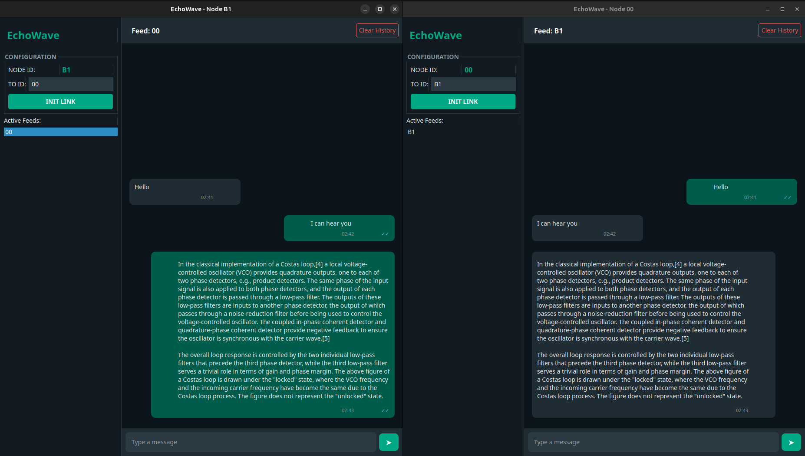
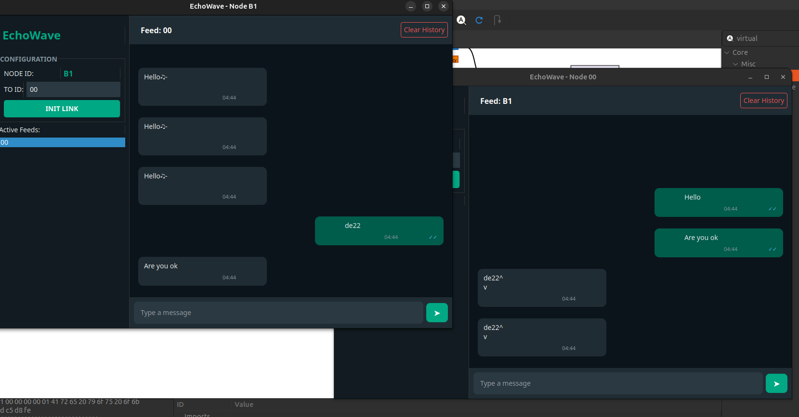

# SDR-Based Two-Way Digital Paging System

## Overview
This repository contains the implementation of a robust two-way digital communication system using Software-Defined Radio (SDR). Built with GNU Radio and Nuand bladeRF hardware, the project features a complete custom protocol stack for reliable text messaging between nodes. 

Designed for two-computer communication, the system integrates a graphical Pager GUI, utilizes custom Python blocks for robust message queuing, and implements intelligent half-duplex channel management to prevent collisions over the air.




---

## Key Features

* **Custom MAC & Priority Arbiter:** Prioritizes control packets (ACKs) over data packets using Fair Queuing and dynamic aging to prevent starvation.
* **Half-Duplex "Carrier Sense":** Intelligent Rx/Tx switching. If a node detects incoming data while attempting to transmit, it pauses its ARQ loop, yields the channel, and resumes seamlessly once the channel is clear.
* **Robust Error & Collision Handling:** **Stop-and-Wait ARQ:** Reliable transmission with automatic timeouts.
  * **Binary Exponential Backoff:** Recovers gracefully from multi-node collisions.
  * **CRC-32 Error Detection:** Automatically rejects corrupted packets at the receiver.
* **Hardware-Level Optimization:** Utilizes prepended dummy bytes to successfully flush hardware buffers and prevent PDU truncation during burst transmissions.
* **Network Scalability:** 8-bit addressing supports up to **256 unique nodes**.
* **Modern GUI:** A PyQt5 desktop dashboard featuring real-time chat, timestamps, and color-coded delivery status indicators (*Sending*, *Sent/ACKed*, *Failed*).
* **Simulation Ready:** Includes ZeroMQ (ZMQ) fallback configurations to simulate the wireless channel across multiple PCs without requiring physical SDRs.

---

## System Architecture

The project follows a strict layered communication architecture, separating the application logic from the GNU Radio signal processing flowgraph using Python Embedded Blocks.

| TCP/IP Layer | Implementation Details |
| :--- | :--- |
| **Application Layer** | EchoWave PyQt GUI, Real-time chat interface, Message history, Delivery status. |
| **Transport Layer** | Automatic fragmentation/reassembly of long messages, Sequence numbering, ACK parsing. |
| **Network Layer** | Node addressing (1-byte Hex), Target destination filtering. |
| **Data Link Layer** | Custom MAC Arbiter, Half-Duplex Pause/Resume logic, Pure ALOHA access, Binary Exponential Backoff, CRC-32 validation. |
| **Physical Layer** | Preamble insertion, QPSK Modulation/Demodulation, Hardware buffer flushing, Manual gain control. |

---

## Communication Protocol specifics

The system allows multiple SDR nodes to communicate over a shared, uncoordinated wireless channel.

**1. Packet Framing**
* Each transmitted packet is framed with a custom header to ensure routing and integrity:

`[ Dest Address | Src Address | ACK Flag | Sequence Num | FIN Flag | Payload Length | Payload Data | CRC-32 ]`

**2. The ARQ Lifecycle**
* **Transmission:** The sender transmits a framed packet and starts a timeout clock.
* **Acknowledgment:** The receiver catches the packet, verifies the CRC-32, drops it if it's a duplicate sequence, and immediately fires back a high-priority ACK.
* **Retransmission:** If the sender's timeout expires before receiving the ACK, it assumes a collision. It calculates a random backoff interval (which grows exponentially with consecutive failures) and tries again, up to a defined retry limit.


---

## Flowgraph Descriptions
The repository is structured around separate `.grc` flowgraphs for testing different MAC protocols and nodes. 

| Flowgraph File | Description |
| :--- | :--- |
| `[arq_tx_name].grc` | Tx flowgraph for Stop-and-Wait ARQ. Queues messages, handles sequencing, and waits for ACKs. |
| `[arq_rx_name].grc` | Rx flowgraph for ARQ. Demodulates, filters duplicates, and automatically transmits ACKs. |
| `[aloha_tx_name].grc` | Tx flowgraph for Pure ALOHA, demonstrating uncoordinated channel access without ACKs. |
| `[aloha_rx_name].grc` | Rx flowgraph for the Pure ALOHA system. |

---

## Hardware & Software Requirements

### Hardware
* Nuand bladeRF (xA4 or xA9 models highly recommended)
* USB 3.0 connection

### Software Stack
* GNU Radio (v3.10+)
* Python 3.x (with PyQt5 for the GUI)
* SoapySDR and `libbladeRF` drivers

> **Recommended Environment:** It is highly recommended to run this system on **Ubuntu**. GNU Radio and SDR hardware drivers are significantly more stable, performant, and easier to configure in a native Linux environment compared to Windows.

---

## Setup & Configuration

### 1. Installing bladeRF Drivers (Ubuntu)
Open your terminal and execute the following commands to install the Nuand PPA, the necessary drivers, and the `gr-osmosdr` package required for GNU Radio integration:

```bash
sudo add-apt-repository ppa:nuand/bladerf
sudo apt-get update
# Install bladeRF tools and specific FPGA packages for xA4/xA9
sudo apt-get install bladerf libbladerf-dev bladerf-fpga-hostedxa4 bladerf-fpga-hostedxa9
# Install osmoSDR to link the bladeRF with GNU Radio
sudo apt-get install gr-osmosdr
```

### 2. Firmware & FPGA Bitstream
1. To ensure compatibility with modern drivers, the bladeRF hardware must be running firmware version 2.6.0.
2. Flash the updated firmware to the bladeRF. Load the corresponding FPGA bitstream for your specific model (`hostedxA4.rbf` or `hostedxA9.rbf`) using the `bladeRF-cli` before executing the flowgraphs.

### 3. GNU Radio Configuration
1. Clone this repository.
2. Open the `.grc` flowgraph files in GNU Radio Companion.
3. Verify that the sample rates match exactly between the Tx and Rx blocks.
4. Adjust the manual gain settings depending on the physical distance between the two SDR nodes to prevent signal loss.

---

## Usage
1. Connect the bladeRF hardware to both Node A and Node B via USB 3.0.
2. Open the flowgraph in GNU Radio Companion and compile it.
3. Launch the `Device_node.grc` file on both machines.
4. Enter the target node's Hex address and begin messaging!

## Authors & Acknowledgments


* **Team EchoWave** (Department of Electronic & Telecommunication Engineering, University of Moratuwa): *(From Left to Right)*  
  * Samarasinghe S.M.R.R. - 230566U
  * Eranga W.A.O. - 230175U
  * Gamage S.K. - 230195F
  * Tharushika G.K.E. - 230636K
